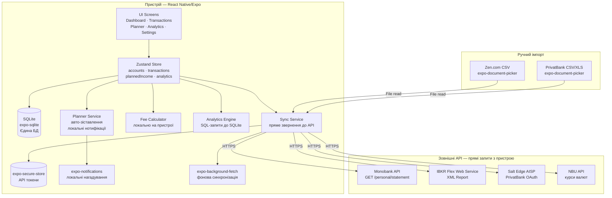

# ARCHITECTURE — Finance Control Mobile App

## Принцип: все на пристрої

Застосунок працює **без жодного власного сервера і хмарної бази даних**. Усі дані зберігаються локально на пристрої у SQLite. Мобільний додаток звертається напряму до зовнішніх API (Monobank, IBKR, Salt Edge). Токени зберігаються у захищеному сховищі пристрою (`expo-secure-store`).

---

## Tech Stack

| Шар | Технологія | Обґрунтування |
|---|---|---|
| Mobile | React Native + Expo SDK 51 | iOS + Android з одного коду, OTA-оновлення |
| State | Zustand | Легкий, без boilerplate, зручний для слайсів |
| Local DB | expo-sqlite (SQLite) | Єдина база даних — повністю на пристрої |
| Secure Storage | expo-secure-store | Зберігання API-токенів у захищеному KeyStore/Keychain |
| Background Sync | expo-background-fetch + expo-task-manager | Фонова синхронізація з API без сервера |
| Notifications | expo-notifications (local) | Push-нотифікації генеруються локально на пристрої |
| XML Parser | fast-xml-parser | Парсинг IBKR Flex XML на пристрої |
| CSV Parser | papaparse | Парсинг Zen CSV на пристрої |
| Auth | expo-local-authentication | Biometric lock (Face ID / Fingerprint), PIN |

---

## Архітектурна діаграма



---

## Модульна структура (`/src`)

```
src/
├── screens/
│   ├── DashboardScreen.tsx
│   ├── TransactionsScreen.tsx
│   ├── PlannerScreen.tsx           # Планер надходжень
│   ├── AnalyticsScreen.tsx         # Аналітика
│   └── SettingsScreen.tsx
│
├── components/
│   ├── AccountCard.tsx
│   ├── TransactionItem.tsx
│   ├── PlannedIncomeForm.tsx       # Форма додавання надходження
│   ├── PlannedIncomeItem.tsx
│   ├── CashflowChart.tsx           # Графік cashflow (план vs факт)
│   ├── AnalyticsFilters.tsx        # Панель фільтрів
│   ├── AnalyticsPlatformChart.tsx  # Bar/Pie по платформах
│   └── AnalyticsKpiCards.tsx       # KPI-картки
│
├── store/
│   ├── accountsSlice.ts
│   ├── transactionsSlice.ts
│   ├── plannedIncomeSlice.ts
│   └── analyticsSlice.ts
│
├── services/
│   ├── monobank.ts          # Прямі запити до Monobank API
│   ├── ibkr.ts              # Прямі запити до IBKR Flex + XML парсинг
│   ├── saltEdge.ts          # Прямі запити до Salt Edge API
│   ├── csvImport.ts         # Парсинг Zen/PrivatBank CSV на пристрої
│   ├── feeCalculator.ts     # Розрахунок комісій
│   ├── plannerService.ts    # Авто-зіставлення, нотифікації
│   ├── analyticsService.ts  # SQL-агрегації по SQLite
│   ├── exchangeRate.ts      # Курси НБУ
│   └── backgroundSync.ts    # expo-background-fetch задачі
│
├── db/
│   ├── schema.ts            # CREATE TABLE statements
│   ├── migrations.ts        # Версіювання схеми
│   └── queries/
│       ├── transactions.ts
│       ├── plannedIncome.ts
│       └── analytics.ts     # SQL-агрегації для аналітики
│
└── security/
    └── tokenStore.ts        # Обгортка над expo-secure-store
```

---

## Потік даних

### Синхронізація транзакцій
1. `BackgroundSync` (або вручну pull-to-refresh) → `SyncService`
2. `SyncService` читає токен з `expo-secure-store` → прямий HTTPS-запит до API
3. Відповідь → `FeeCalculator` → `UnifiedTransaction`
4. Збереження у SQLite → Zustand Store → UI оновлюється

### Планер надходжень
1. Користувач → `PlannedIncomeForm` → запис у SQLite
2. При відкритті застосунку: `PlannerService.checkOverdue()` → змінює статус прострочених
3. `expo-notifications` (scheduled local) → нагадування за N днів
4. Нова транзакція → `PlannerService.tryAutomatch()` → якщо ≈ сума+дата → статус `matched`

### Аналітика
1. Користувач відкриває екран Analytics або змінює фільтри
2. `AnalyticsService` → SQL-запит до SQLite (GROUP BY platform / DATE)
3. Результат → Zustand `analyticsSlice` → Charts + KPI Cards
4. Кеш у SQLite з TTL 30 хв (щоб не перераховувати при кожному скролі)

---

## Безпека токенів

Оскільки немає сервера, токени зберігаються безпосередньо на пристрої у захищеному сховищі ОС:

| Платформа | Де зберігається |
|---|---|
| iOS | Keychain Services |
| Android | Android Keystore (EncryptedSharedPreferences) |

```typescript
// src/security/tokenStore.ts
import * as SecureStore from 'expo-secure-store';

export const tokenStore = {
  set: (key: string, value: string) =>
    SecureStore.setItemAsync(key, value, {
      keychainAccessible: SecureStore.WHEN_UNLOCKED_THIS_DEVICE_ONLY,
    }),

  get: (key: string) => SecureStore.getItemAsync(key),

  delete: (key: string) => SecureStore.deleteItemAsync(key),
};

// Ключі токенів
export const TOKEN_KEYS = {
  monobank:  'token_monobank',
  ibkr:      'token_ibkr_flex',
  saltEdge:  'token_salt_edge',
} as const;
```

---

## Фонова синхронізація

```typescript
// src/services/backgroundSync.ts
import * as BackgroundFetch from 'expo-background-fetch';
import * as TaskManager from 'expo-task-manager';

const SYNC_TASK = 'BACKGROUND_SYNC';

TaskManager.defineTask(SYNC_TASK, async () => {
  try {
    await syncMonobank();
    await syncIBKR();
    await syncSaltEdge();
    return BackgroundFetch.BackgroundFetchResult.NewData;
  } catch {
    return BackgroundFetch.BackgroundFetchResult.Failed;
  }
});

export async function registerBackgroundSync() {
  await BackgroundFetch.registerTaskAsync(SYNC_TASK, {
    minimumInterval: 60 * 60, // мінімум 1 година (iOS обмеження)
    stopOnTerminate: false,
    startOnBoot: true,
  });
}
```

> **Примітка:** iOS дозволяє фонову синхронізацію не частіше ніж раз на ~15–60 хвилин і тільки якщо система вирішить виділити час. Для актуальних даних користувач може вручну оновити через pull-to-refresh.

---

## Обмеження без сервера

| Ситуація | Наслідок | Вирішення |
|---|---|---|
| Monobank Webhook | Webhook потребує сервера для прийому POST | Замінено на поллінг (1×/год або вручну) |
| Salt Edge OAuth redirect | Потребує `redirect_uri` | Використовуємо Expo deep link (`financeapp://callback`) |
| IBKR дані 1×/день | Обмеження IBKR, не залежить від архітектури | Синхронізація вранці через фоновий task |
| Дані недоступні без інтернету | SQLite зберігає все локально | Повний офлайн-перегляд без обмежень |
