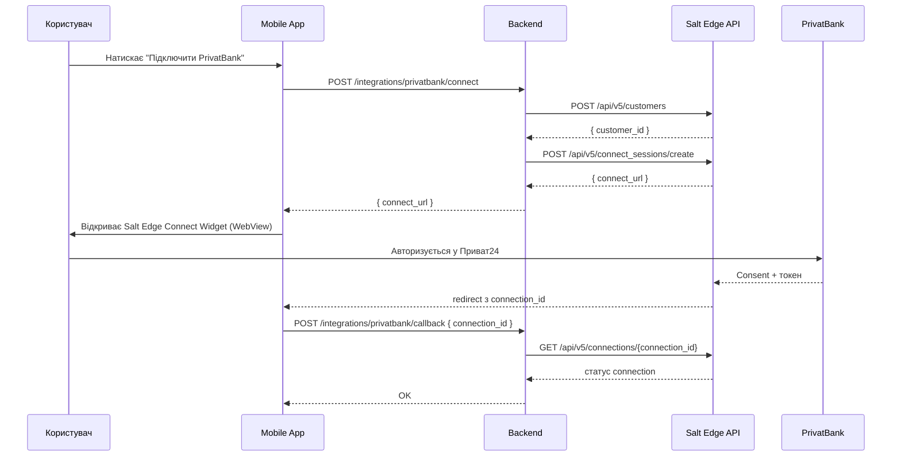

# PrivatBank Integration

## Доступні методи

| Метод | Тип акаунту | Складність | MVP |
|---|---|---|---|
| **Salt Edge AISP** | Фізична особа | Середня | ✅ |
| **CSV/XLS імпорт** | Фізична особа | Низька | ✅ (fallback) |
| **AutoClient API** | ФОП / Бізнес | Висока | Майбутнє |

---

## 1. Salt Edge AISP (основний метод для фіз. особи)

Salt Edge — ліцензований AISP-агрегатор, що надає доступ до PrivatBank через Open Banking-сумісний інтерфейс.

### Реєстрація

1. Зареєструйтесь на [saltedge.com/products/account_information](https://www.saltedge.com/products/account_information)
2. Отримайте `App ID` та `Secret`
3. Зберігайте у `expo-secure-store` на пристрої (вводяться один раз при першому підключенні через екран Налаштувань)

### Потік підключення (OAuth Consent)



### Salt Edge API — ключові ендпоінти

```
Base URL: https://www.saltedge.com

# Створити клієнта (1 раз на користувача)
POST /api/v5/customers
Body: { "data": { "identifier": "user_uuid" } }

# Створити сесію підключення
POST /api/v5/connect_sessions/create
Body: {
  "data": {
    "customer_id": "...",
    "consent": { "scopes": ["account_details","transactions"], "from_date": "2025-01-01" },
    "return_to": "financeapp://privatbank-callback"  // Expo deep link, без сервера
  }
}

# Отримати транзакції
GET /api/v5/transactions?connection_id={id}&account_id={acc_id}&from_made_on={date}

# Перелік рахунків
GET /api/v5/accounts?connection_id={id}
```

### Структура транзакції Salt Edge

```json
{
  "id": "987654321",
  "duplicated": false,
  "mode": "normal",
  "status": "posted",
  "made_on": "2026-04-01",
  "amount": -1500.00,
  "currency_code": "UAH",
  "description": "Сільпо",
  "category": "groceries",
  "account_id": "111222333",
  "created_at": "2026-04-01T12:30:00Z",
  "extra": {
    "payee": "SILPO",
    "payee_information": "...",
    "mcc": 5411
  }
}
```

> **Обмеження:**
> - Максимум 31 день в одному запиті
> - Consent дійсний 180 днів (потім потрібне повторне погодження)
> - Поле комісії відсутнє (обчислюємо через spread, якщо є валютна конвертація)

### Маппінг до UnifiedTransaction

```typescript
function mapSaltEdgeTx(tx: SaltEdgeTx, accountId: string): UnifiedTransaction {
  return {
    id:              generateId(),
    platform:        'privatbank',
    externalId:      tx.id,
    accountId,
    type:            tx.amount >= 0 ? 'income' : 'expense',
    amount:          tx.amount,
    currency:        tx.currency_code,
    feeAmount:       0, // немає в API для фіз. особи
    description:     tx.description,
    category:        tx.category,
    mcc:             tx.extra?.mcc,
    counterparty:    tx.extra?.payee,
    transactionDate: new Date(tx.made_on),
    rawPayload:      tx,
  };
}
```

---

## 2. CSV/XLS Fallback (ручний імпорт)

Якщо Salt Edge недоступний або користувач не хоче проходити OAuth:

### Як експортувати виписку з Приват24

1. **Приват24** → Картки → Вибрати картку → **Виписка**
2. Встановити діапазон дат
3. Формат: **Excel (XLS)** або **CSV**
4. Завантажити файл

### Формат CSV від PrivatBank

```
Дата;Час;Категорія;Опис операції;Картка;Сума в валюті картки;Валюта картки;Сума в гривнях;Валюта;Залишок на кінець;Валюта залишку
01.04.2026;12:30:00;Продукти;Сільпо;5375****1234;-1500.00;UAH;-1500.00;UAH;98500.00;UAH
```

### Парсинг CSV (backend)

```typescript
import { parse } from 'csv-parse/sync';

function parsePrivatCSV(csvContent: string): UnifiedTransaction[] {
  const rows = parse(csvContent, {
    delimiter: ';',
    fromLine: 2,           // пропустити заголовок
    encoding: 'utf-8',
  });

  return rows.map((row: string[]) => ({
    id:              generateId(),
    platform:        'privatbank',
    type:            parseFloat(row[5]) >= 0 ? 'income' : 'expense',
    amount:          parseFloat(row[5].replace(',', '.')),
    currency:        row[6],
    description:     row[3],
    category:        row[2],
    transactionDate: parsePrivatDate(row[0], row[1]),
    feeAmount:       0,
    rawPayload:      { csv_row: row },
  }));
}
```

---

## 3. ФОП / Бізнес (майбутнє) — AutoClient API

> Планується для v2.0

- Потребує **Merchant ID** + **Password** + **IP whitelist** від PrivatBank
- Endpoint: `https://acp.privatbank.ua/api/`
- Дає доступ до виписки по корпоративним рахункам
- Повертає дані у форматі JSON

---

## Стратегія синхронізації

| Метод | Частота |
|---|---|
| Salt Edge (автоматично) | 1 раз / 6 годин (Salt Edge кешує дані від банку) |
| CSV (ручний) | На вимогу користувача |
| Перший імпорт | За 90 днів (3 запити по 31 день) |
